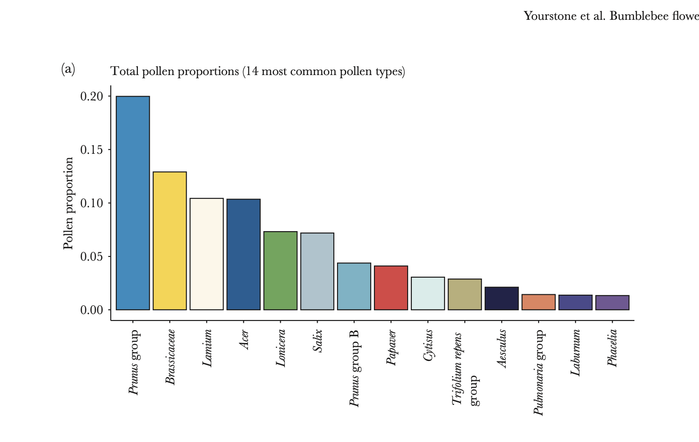

```{r setup, include=FALSE}
knitr::opts_chunk$set(echo = TRUE)
```

My study is testing the theory that bees prefer to frequent the same flowers, as opposed to visiting multiple different flowers in a patch. Sampling was done in Sweden with reared colonies of bees in an open field. Bees were individually marked and tagged and left to pollinate for 5 days at a time. After each period pollen was removed from the bees bodies and collected in jars. Machine learning was used to identify pollen samples from specific flowers which were identified in the field. After the program was run, individual pollen samples from tagged bees were added to a csv file, noting each bee and where their pollen came from, as well as how much (in g) of pollen they had extracted from each flower species per trip. 

First, let's call our data!
```{r csv, include=FALSE}
bee_data <- read.csv("bee_data.csv", sep = ',', header = TRUE, stringsAsFactors = TRUE)
bee_data
head(bee_data)
```
Now, we must identify and name all of the relevant columns within the csv. Here I am calling the columns of flower species that pollen was taken from, and giving them an easier and more memorable name to work with throughout the replication assignment.
```{r calling rows, include=FALSE}
Prunus <- (bee_data$P_Prunus.group)
Prunus
Brassicaceae <- (bee_data$P_Brassicaceae)
Brassicaceae
Lamium <- (bee_data$P_Lamium)
Lamium
Acer <- (bee_data$P_Acer)
Acer
Lonicera <- (bee_data$P_Lonicera)
Lonicera
Salix <- (bee_data$P_Salix)
Salix
Prunus_Group_B <- sample(bee_data$P_Prunus.groupB)
Prunus_Group_B
Papaver <- (bee_data$P_Papaver)
Papaver
Cytisus <- (bee_data$P_Cytisus)
Cytisus
Trifolium_repens <- (bee_data$P_Trifolium.repens.group)
Trifolium_repens
Aesculus <- (bee_data$P_Aesculus)
Aesculus
Pulmonaria_Group <- (bee_data$P_Pulmonaria.group)
Pulmonaria_Group
Laburnum <- (bee_data$P_Laburnum)
Laburnum
Phacelia <- (bee_data$P_Phacelia)
Phacelia
```

In order to replicate our first figure, the mean weight (in grams) of each pollen type needs to be calculated. By using the mean() function I am directly calculating the averages of each column that I assigned in the previous step.
```{r calculating means, include=TRUE}
mean(Prunus)
mean(Brassicaceae)
mean(Lamium)
mean(Acer)
mean(Lonicera)
mean(Salix)
mean(Prunus_Group_B)
mean(Papaver)
mean(Cytisus)
mean(Trifolium_repens)
mean(Aesculus)
mean(Pulmonaria_Group)
mean(Laburnum)
mean(Phacelia)
```
It's time to start plotting our figure! First, I am setting a character vector "means" that is comprised of all of the means calculated in the first step. This will allow me to call my "means" easily and quickly when I code my bar chart. Next, I'm setting a character vector of flower species "Flower_species" for the same reason. This will allow me to call all of the species on the x-axis using the names.arg() argument later on. Finally, I am importing a package to allow me to assign colors to my bars to distinguish species visually.
```{r bar chart, include=TRUE}
#setting a common numerical value to pull from in the y axis
means <- c(mean(Prunus), mean(Brassicaceae), mean(Lamium), mean(Acer), mean(Lonicera), mean(Salix), mean(Prunus_Group_B), mean(Papaver), mean(Cytisus), mean(Trifolium_repens), mean(Aesculus), mean(Pulmonaria_Group), mean(Laburnum), mean(Phacelia))
#Now using a character vector to pull names of each group on the x-axis
Flower_species <- c("Prunus", "Brassicaceae", "Lamium", "Acer", "Lonicera", "Salix", "Prunus_Group_B", "Papaver", "Cytisus", "Trifolium_repens", "Aesculus", "Pulmonaria_Group", "Laburnum", "Phacelia")
library(RColorBrewer)
coul <- brewer.pal(14, "Set3")
#This sets rainbow colors for my graph
par(mar=c(8,4,4,1)+.1)
#This changes the margins on my graph, the first one deals with the bottom allowing me to fit all the words onto the chart
barplot(means, ylim = c(0.00, 0.20), names.arg = Flower_species, las = 2, space = 0.05, xlab = " ", ylab = "Pollen Proportion", main = "Pollen Proportion vs. Flower Species", col=coul, cex.axis=0.9)
# las = 2 moves the x-axis labels vertical
```
To compare, let's pull the original chart made by the authors. Looks pretty good!


In the paper, the researchers ran a Jaccard similarity test on a scale of 0 to 1. Jaccard similarity of 0 means the variables had no overlap, and 1 means the variables had extreme overlap. I ran one of the similarity tests between pollen sample and colony ID and got that there was no overlap between the colony the bees were a part of and the pollen they sampled, meaning that these two variables do not affect each other, and instead, allow us to conclude that something else (other than the colony bees come from) is what's causing this constancy. And indeed, the authors proposed that colony DISTANCE is what is primarily affecting the return to the same flowers.
```{r Jaccard pollen similarity, include=TRUE}
colony <- (bee_data$coln)
pollen.sample <- (bee_data$filn)
jaccard <- function(colony, pollen.sample) {
    intersection = length(intersect(colony, pollen.sample))
    union = length(colony) + length(pollen.sample) - intersection
    return (intersection/union)
}
jaccard(colony,pollen.sample)
```

```{r trial, include=TRUE}
dates <- summary(bee_data$dat)
dates
length(dates)
length(colony)
```

```{r trial, include=TRUE}
glm <- glm(data = bee_data, dates ~ colony, family = "binomial")
```
Now let's run a mixed effects model to try and understand the relationship between our patch (aka distance, as each patch is a different distance from the colony) and pollen type


```{r factors, include=TRUE}
# creating the factor variable
bee_data$coln <- factor(bee_data$coln)
is.factor(bee_data$coln)
```

```{r LMM, include=TRUE}
bees <- (bee_data$bbid)
lmer(dates ~ colony + (colony | bees), bee_data)
```
The authors stated that the pollen from the Prunus group of flowers was the most pollinated overall, with the total percentage of pollen samples from these flowers equaling 20%. To test this I first named all the means of each flower species to be able to use them in a later calculation. Then, I added all of these called means together to get the whole number of pollen samples from each species together. Finally, I divided that total means number just calculated by the mean of the Prunus group flowers and multiplied by 100%. 
```{r percentage Prunus Group, include=TRUE}
mean_Prunus <- mean(Prunus) #naming the numerical outputs for later calculation
mean_Brassicaceae <- mean(Brassicaceae)
mean_Lamium <- mean(Lamium)
mean_Acer <- mean(Acer)
mean_Lonicera <- mean(Lonicera)
mean_Salix <- mean(Salix)
mean_Prunus_Group_B <- mean(Prunus_Group_B)
mean_Papaver <- mean(Papaver)
mean_Cytisus <- mean(Cytisus)
mean_Trifolium_repens <- mean(Trifolium_repens)
mean_Aesculus <- mean(Aesculus)
mean_Pulmonaria_Group <- mean(Pulmonaria_Group)
mean_Laburnum <- mean(Laburnum)
mean_Phacelia <- mean(Phacelia)

total_means <- (mean_Prunus + mean_Brassicaceae + mean_Lamium + mean_Acer + mean_Lonicera + mean_Salix + mean_Prunus_Group_B + mean_Papaver + mean_Cytisus + mean_Trifolium_repens + mean_Aesculus + mean_Pulmonaria_Group + mean_Laburnum + mean_Phacelia) #Adding up all the numerical outputs to allow for an easy calculation in the next step
total_means
percent_prunus_group <- (mean_Prunus/total_means)*100 #Calculating the percentage of our desired species by dividing by the whole and multiplying by 100
percent_prunus_group
```
My final output was 22.07%, rounding down to 20%, the same as what our author's stated! (It would be nice to see a little bit more accuracy from them though!)
